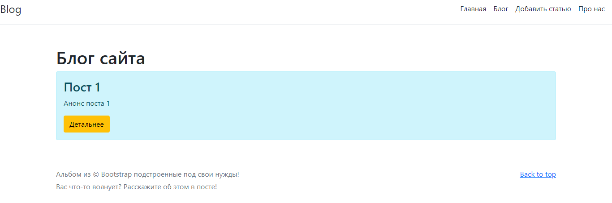
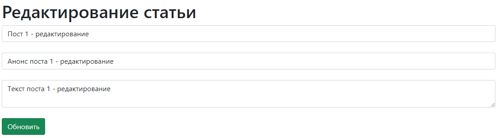
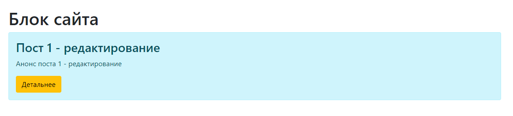
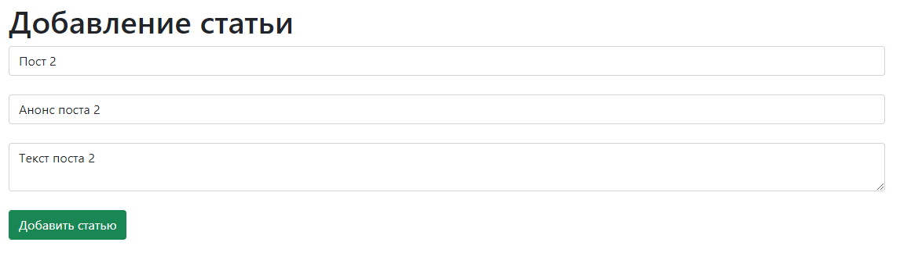
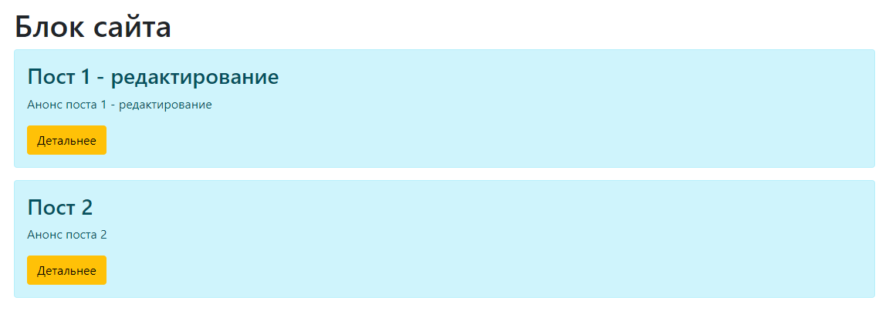

# Web-blog
Создание мини веб блога с целью изучения технологии Spring Boot MVC

**Возможности:**

- Создание простейших постов только с текстом. 

- Редактирование поста. 

- Сохранение заметки между сеансами приложения, при помощи MySQL.

- При первом запуске, приложение имеет один пост.

- Возможность редактирования любого поста из списка.

- Удаление постов  

**Скриншоты приложения**

Стартовая страница в данный момент не доработана.

Нажав на кнопку Блог можно перейти к просмотру имеющихся записей :

Кнопка детальнее выводит полный текст поста и дает доступ к удалению и редактированию записи:

 

 
 

 
 

 
  

  
  

 
Данные сразу сохраняются в базу данных.

Написано по видеокурсу "Уроки Java Spring Boot" на сайте itproger (https://itproger.com/course/java-spring).

